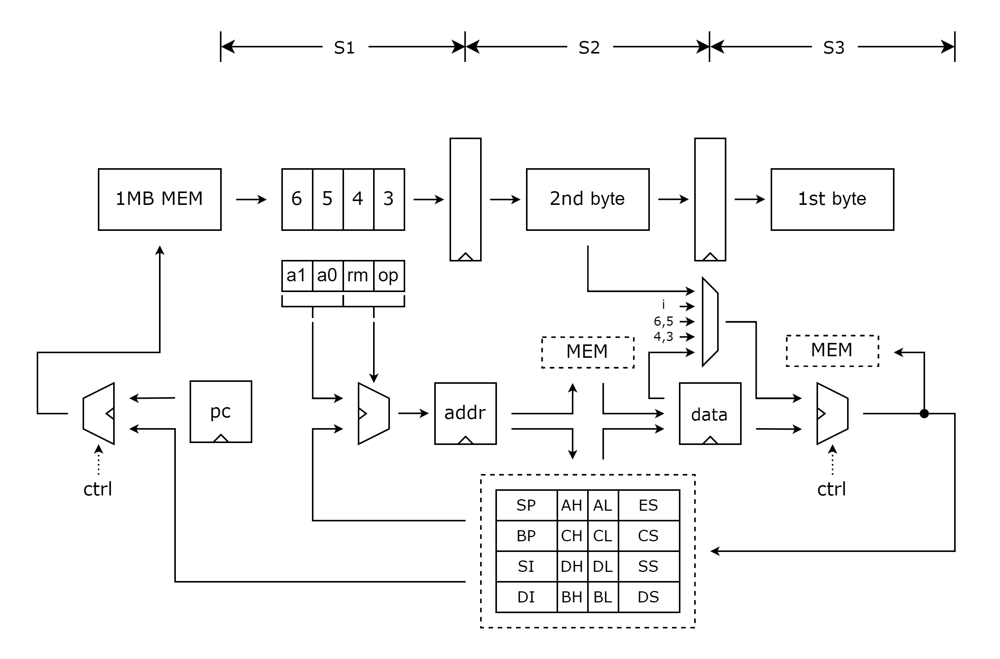

# T8086

This is a repository for a soft CPU core compatible for Intel 8086. 8086 is a 16-bit microprocessor with 16-bit width registers, as well as internal and external data buses. The address space is addressed by means of internal memory "segmentation". A 20-bit external address bus provides a 1 MiB physical address space, programming over 64 KB memory boundaries involves adjusting the segment registers simply because internal address/index registers are only 16 bits wide. The data bus is multiplexed with the address bus in order to fit all of the control lines into a standard 40-pin dual in-line package.

## Introduction

Since our CPU will be implemented on FPGA, different execution/memory architectures and peripheral ports will be employed.

- We build three-stage pipelined architecture for instruction execution, comprising address generating, operand fetching, execute and write back stages, instructions will take maximum six machine cycles to finish execution.

- We setup 1MB on-chip memory, where ROM takes 0xC0000-0xFFFFF address space, and RAM occupies the other.

- We provide a interface for the peripherals on FPGA board.

## Architecture

## Reference

[Intel 8086 - Wikipedia](https://en.wikipedia.org/wiki/Intel_8086#Background)

